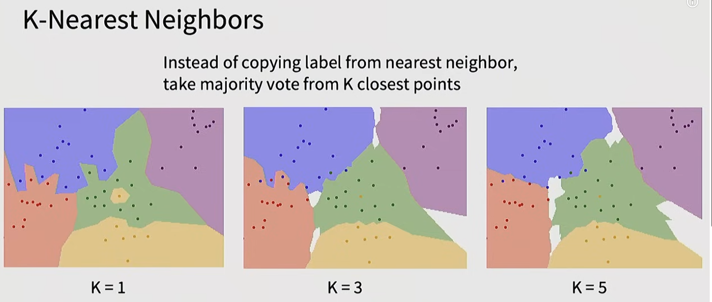
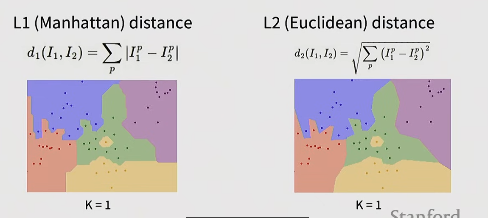
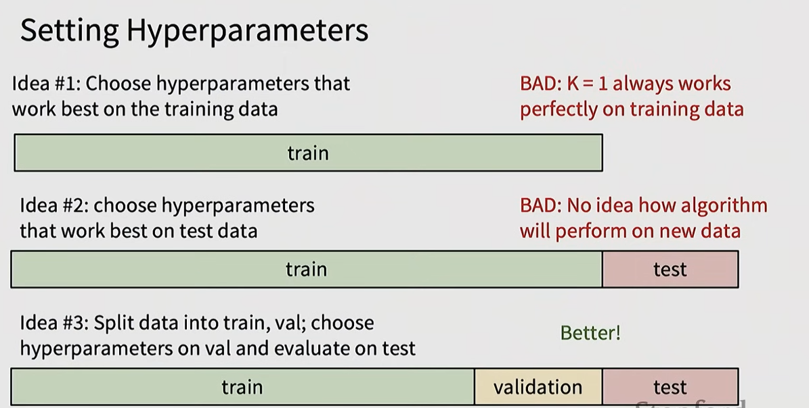
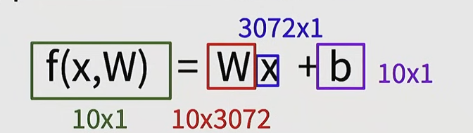
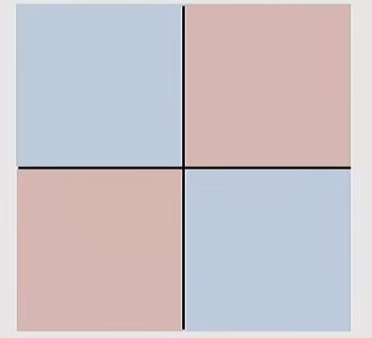
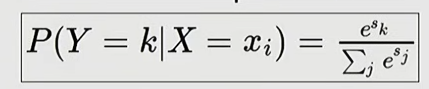

### challenge
* different camera from the same thing can present different data point

* illumination（光照）

光照影响
* background clutter(杂物)

* occulution (隐藏)

* deformaion(变形)

* intraclass variaion(同一个种类多种多样)

* context
识别的物体会因为周围环境的变化而导致不同的结果

### KNN
* l1 distance
使用最简单的l1 distance来实现分类

其中np.sum利用了numpy的广播机制来实现相加

使用不同的k-nearest neighbor去实现点颜色的预测
k-nearest neighbor：
用投票的方式在距离最近的k个颜色选择
distance metric:
l1 distance(manhatten):
$$d(x, y) = \sqrt{\sum_{i=1}^{n} \left| x_i - y_i \right|}$$

l2 distance:
$$d(x, y) = \sqrt{\sum_{i=1}^{n} (x_i - y_i)^2}$$

$L_2$ 追求的是“整体的平均和谐”（代价是牺牲细节、变模糊）；而 $L_1$ 允许局部存在大差异，从而能够忠实地保留（Preserve）原本清晰、稀疏且显著的特征。

旋转xy特征，l1特征会变而l2特征不会变化
白色的区域我们无法识别到具体的颜色
白色的区域可以说是重点要寻找数据的地方

使用l1和l2在k=1的时候是相同的，l2 distance会更加平和

http://vision.stanford.edu/teaching/cs231n-demos/knn/ 可以去查看hyperparameter(k)对于结果的影响，还有distance function对于结果的影响

* how to set hyperparameter

### linear classifier

从这张图可以看出我们不会使用最后的结果是（10）而是用(10,1)这种

* 在 1 维空间（只有一条数轴），分类器用一个点来区分正负；
* 在 2 维空间（一个平面），分类器用一条 1 维的直线把二维平面一分为二（一边是 $f(x)>0$，另一边是 $f(x)<0$）；
* 在 3 维空间（立体空间），分类器用一个 2 维的平面把空间切成两半；
* 在 $N$ 维高维空间，分类器用一个 $N-1$ 维的“超平面”（Hyperplane）来切割空间。

对于这种线性分类器来说

很难做区别
* softmax

Maximum Likelihood Estimation
Choose weights to maximize the likelihood of the observed data
最大似然估计（MLE）：选择权重（参数），使得观测到当前数据的概率（似然度）最大化。

#### cross entropy
loss fuction的目标是：
$$L_i = -\log P(Y = y_i \mid X = x_i)$$
最小化这个
* Information & Entropy：
$$I(x) = -\log P(x)$$
* 香农熵（Information Entropy）：
$$H(P) = -\sum_{x} P(x) \log P(x)$$
* 交叉熵（Cross Entropy）：
$$H(P, Q) = -\sum_{x} P(x) \log Q(x)$$
* KL散度(KL Divergence):
$$D_{KL}(P \parallel Q) = H(P, Q) - H(P)$$

我们应该最小化两者的差异 $D_{KL}(P \parallel Q)$，但因为 $D_{KL}(P \parallel Q) = H(P, Q) - H(P)$，且真实标签的熵 $H(P)$ 是个固定常数，最小化 KL 散度等价于直接最小化交叉熵 $H(P, Q)$。