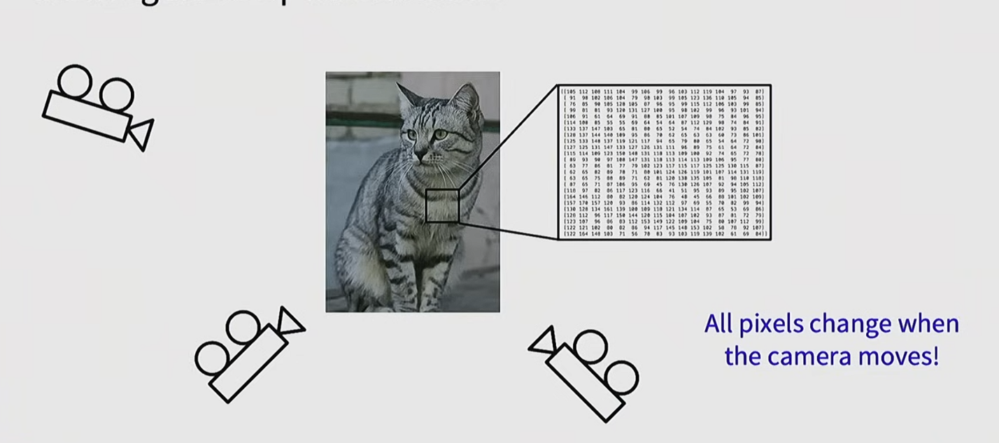
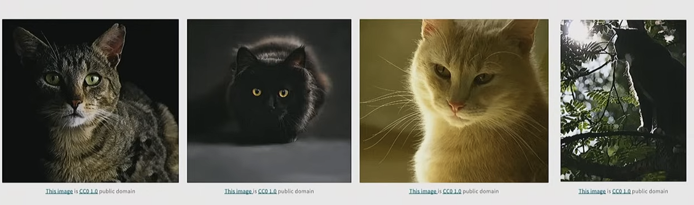
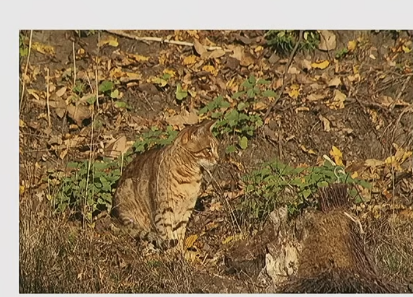
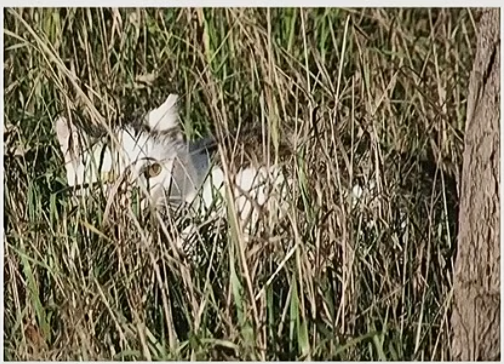
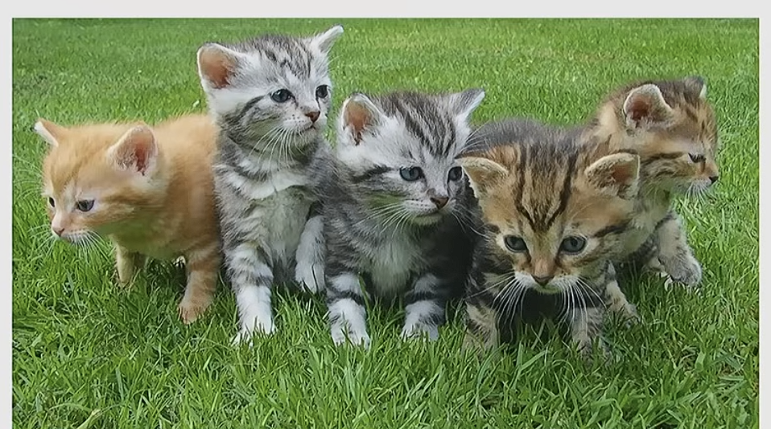
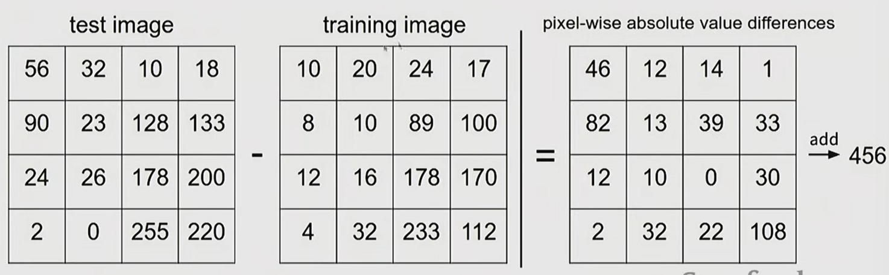
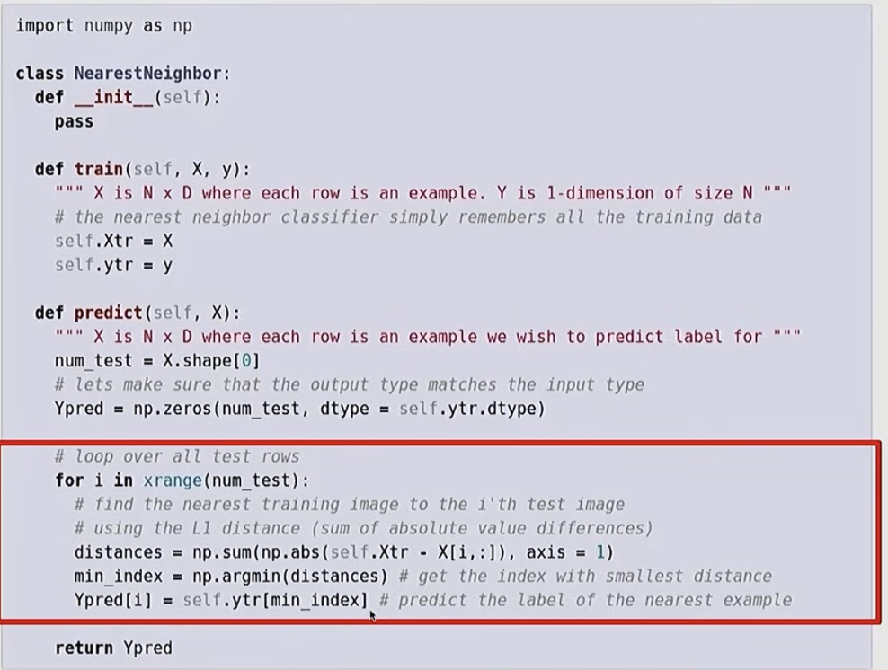

### challenge
* different camera from the same thing can present different data point

* illumination（光照）

光照影响
* background clutter(杂物)

* occulution (隐藏)

* deformaion(变形)

* intraclass variaion(同一个种类多种多样)

* context
识别的物体会因为周围环境的变化而导致不同的结果

### linear classify
* l1 distance
使用最简单的l1 distance来实现分类

其中np.sum利用了numpy的广播机制来实现相加